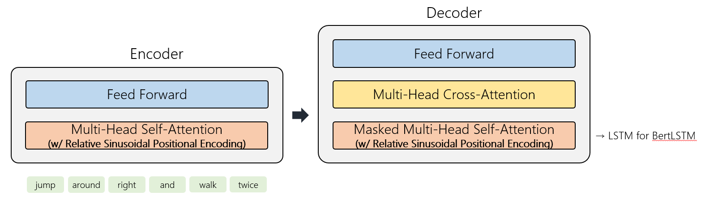

## [Systematic Generalization](https://arxiv.org/abs/1711.00350)
Human language and thought are characterized by systematic compositionality, the algebraic capacity to understand and produce a potentially infinite number of novel combinations from known components. For example, if a person knows the meaning and usage of words such as “twice,” “and,” and “again,” once she learns a new verb such as “to dax” she can immediately understand or produce instructions such as “dax twice and then dax again.” This type of compositionality is central to the human ability to make strong generalizations from very limited data. In a set of influential and controversial papers, Jerry Fodor and other researchers have argued that neural networks are not plausible models of the mind because they are associative devices that cannot capture systematic compositionality.

## A Simple Yet Effective Baseline

## Results
### Model Configuration
| Model Size | Hidden Size | Num Layers | Num Heads    | Intermediate Size |
| :--------: | :---------: | :--------: | :----------: | :---------------: |
| Small      | 256         | 3          | 4            | 1024              |
| Base       | 512         | 6          | 8            | 2048              |
| Large      | 768         | 12         | 12           | 3072              |

### Hyperparameter
| Batch Size | Learning Rate | Weight Decay | Max Norm | Num Epochs |
| :--------: | :-----------: | :----------: | :------: | :--------: |
| 32         | 5e-5          | 1e-5         | 1.0      | 300        |

### Experiment Results (Model Size = Base)
| Dataset | Split Type    | Model       | Accuracy   | Best Accuracy |
| :-----: | :-----------: | :---------: | :--------: | :-----------: |
| COGS    | gen           | transformer | 0.7912     | 0.8182        |
| COGS    | gen           | roformer    | 0.8080     | 0.8130        |
| COGS    | gen           | bertlstm    | **0.8196** | **0.8243**    |
| CFQ     | length        | transformer | **0.8464** | **0.8593**    |
| CFQ     | length        | roformer    | 0.7876     | 0.8062        |
| CFQ     | length        | bertlstm    | 0.8045     | 0.8144        |
| PCFG    | productivity  | transformer | 0.8183     | 0.8183        |
| PCFG    | productivity  | roformer    | 0.7681     | 0.7683        |
| PCFG    | productivity  | bertlstm    | **0.8616** | **0.8671**    |
| PCFG    | systematicity | transformer | 0.9368     | 0.9372        |
| PCFG    | systematicity | roformer    | 0.9188     | 0.9192        |
| PCFG    | systematicity | bertlstm    | **0.9573** | **0.9608**    |

### Hyperparameter Sensitivity (COGS, gen)
| Model       | Model Size | Accuracy   |
| :---------: | :--------: | :--------: |
| transformer | Small      | **0.8185** |
| transformer | Base       | 0.7912     |
| transformer | Large      | 0.7733     |
| bertlstm    | Small      | 0.7752     |
| bertlstm    | Base       | **0.8196** |
| bertlstm    | Large      | 0.7884     |

### [SOTA Results](https://arxiv.org/abs/2108.12284)
| Dataset | Split Type    | Accuracy |
| :-----: | :-----------: | :------: |
| COGS    | gen           | 0.77     |
| CFQ     | length        | 0.81     |
| PCFG    | productivity  | 0.85     |
| PCFG    | systematicity | 0.96     |

## Notes
- 참고로, Systematic Generalization은 사전 학습 모델 사용 여부 혹은 Distribution Shift에 대한 사전 지식 여부에 따라 여러 세팅이 존재하는데, 여기서는 아무런 사전 정보 없이 Scratch부터 학습하는 세팅을 다룬다. (다만, 일부 데이터셋의 경우 테스트 데이터에 새로운 Token이 존재해 어쩔 수 없이 틀리게 된다.)
- Systematic Generalization은 Out-of-Distribution Generalization과 유사하게 하이퍼파라미터에 민감하지만, 하이퍼파라미터 튜닝에 Validation 데이터를 사용하는 것은 모순이 될 수 있다. 실제로 Validation 데이터를 학습에 사용하면 하이퍼파라미터 튜닝 없이도 굉장히 높은 정확도를 보인다.
- 위의 Experiment Results는 모두 일반적으로 사용되는 하이퍼파라미터 조합 하나에 대해 실험한 결과이며, 하이퍼파라미터를 바꾸면 정확도가 크게 바뀌는 것을 확인하였다. SOTA 모델은 데이터셋마다 서로 다른 하이퍼파라미터를 사용하였으며 (논문의 Table 4 참고), 코드를 참고했을 때 Validation 데이터를 이용하여 하이퍼파라미터를 튜닝한 것으로 보인다.
- 정확도가 높은 모델도 테스트 데이터에 속하지는 않지만 학습 데이터로 조합할 수 있는 간단한 데이터에 대해 제대로 예측을 못하는 경우가 많다.
